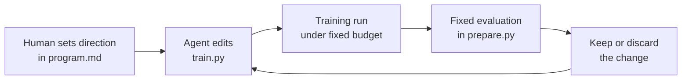
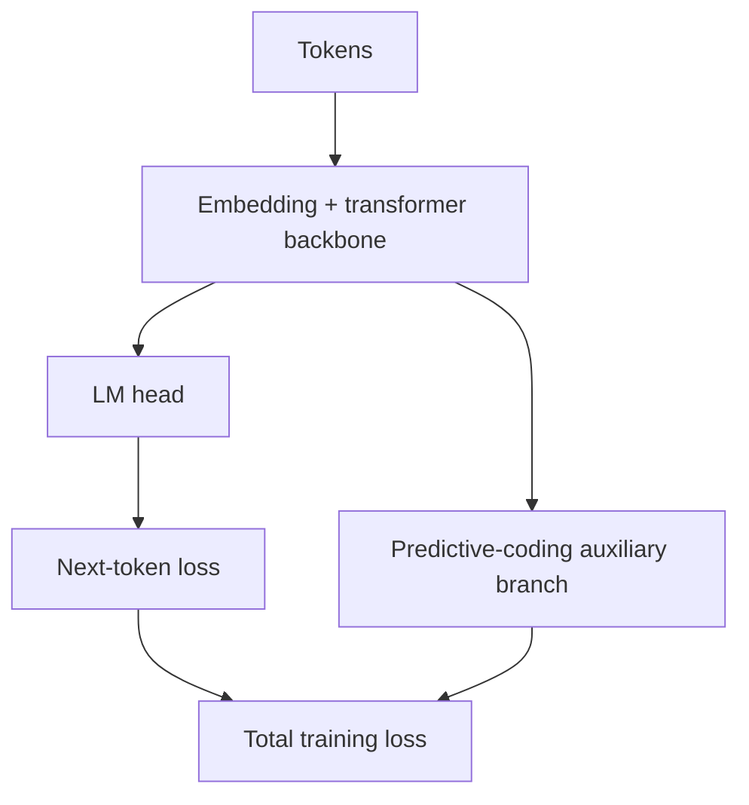

# autoresearch

`autoresearch` is a compact environment for autonomous model research. The goal is to let an agent improve a language model inside a tightly scoped loop while the human controls the agenda, constraints, and acceptance criteria.

Instead of manually editing training code for every idea, you define the research setup in `program.md` and let the agent iterate on a small training stack. The repo stays intentionally small so experiments are easy to inspect, compare, and steer.

## Why this project exists

Most research codebases are too large and too unconstrained for reliable autonomous iteration. This project narrows the surface area on purpose:

- The agent changes one main file: `train.py`.
- Evaluation stays fixed in `prepare.py`.
- The run budget is fixed so architectural changes are compared under the same practical constraint.
- The human edits the research brief in `program.md` instead of micromanaging each code change.

The point is not to build a general training framework. The point is to create a clean loop for testing whether an agent can make useful research decisions on its own.

## High-Level Loop



This loop is deliberately simple. Simplicity makes failures legible, diffs reviewable, and iteration policies easy to change.

## System Shape



The current training stack is a small single-GPU language model with an auxiliary predictive-coding branch. The transformer backbone still feeds the LM head directly. The PC path reads intermediate layer activations during training and adds an extra loss; it is not a serial stage between the transformer and the LM head.

For the full model breakdown, see `docs/architecture.md`.

## What Actually Runs

`train.py` currently hard-codes a `cuda` device and uses bf16 autocast, so this repo should be treated as a CUDA-only, single-GPU experiment setup.

`prepare.py` is the fixed support script. At a high level it:

- downloads the configured Parquet shards into `~/.cache/autoresearch/data`
- trains the local BPE tokenizer in `~/.cache/autoresearch/tokenizer`
- builds the `token_bytes` lookup used by BPB evaluation
- exposes the dataloader, tokenizer, and `evaluate_bpb()` utilities that `train.py` imports

## Experimental Surface

- `program.md`: the human-written research brief for the agent.
- `train.py`: run configuration, resume behavior, compile mode, logging, early stop policy, and the top-level training loop.
- `model.py`: the actual model architecture, auxiliary PC branch, special layers, and optimizer parameter grouping.
- `optimizer.py`: the custom Muon/AdamW optimizer implementation used by training.
- `prepare.py`: fixed data preparation and evaluation utilities; this is intentionally not part of the normal architecture-editing loop.
- `smoke_test.py`: quick regression coverage for the training stack.
- `docs/`: architecture notes, run history, reviewer/coder handoff notes, and open research questions.
- `Instructions.md`: practical commands for setup, training, and sampling.

## Getting Started

Install dependencies, prepare the local cache, and verify that a training run works:

```bash
uv sync
uv run prepare.py
uv run train.py
```

You will need a working NVIDIA CUDA environment for `uv run train.py`. After setup, point your coding agent at `program.md` and let it operate inside the loop described above.

## Design Principles

- Small scope makes experimental changes easier to review and reason about.
- Fixed evaluation makes comparisons more trustworthy.
- A local, lightweight stack keeps iteration latency low.
- Markdown-based steering keeps the research brief separate from the training code.

## License

MIT
