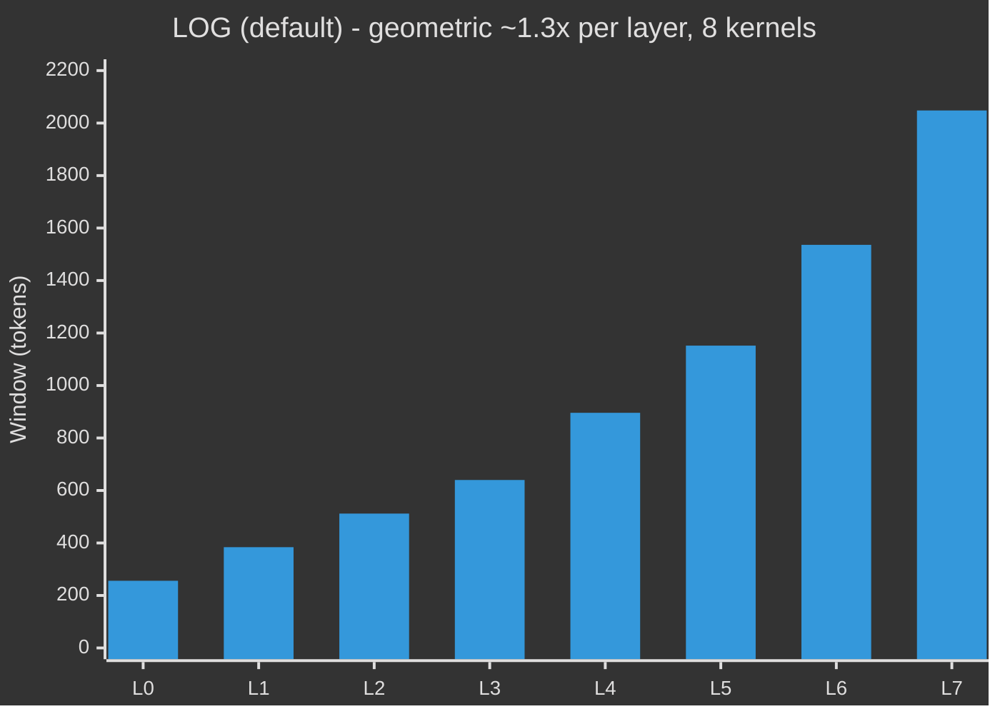
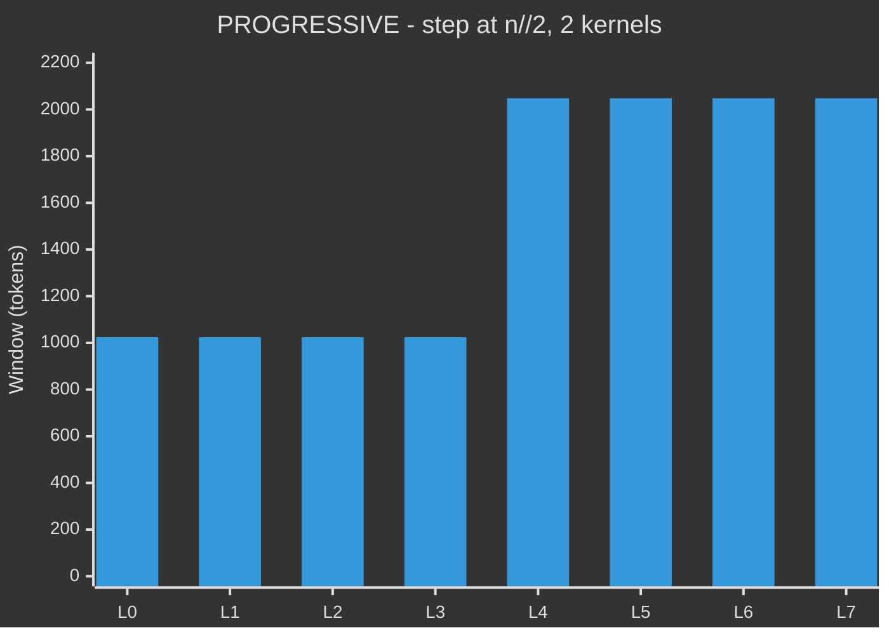
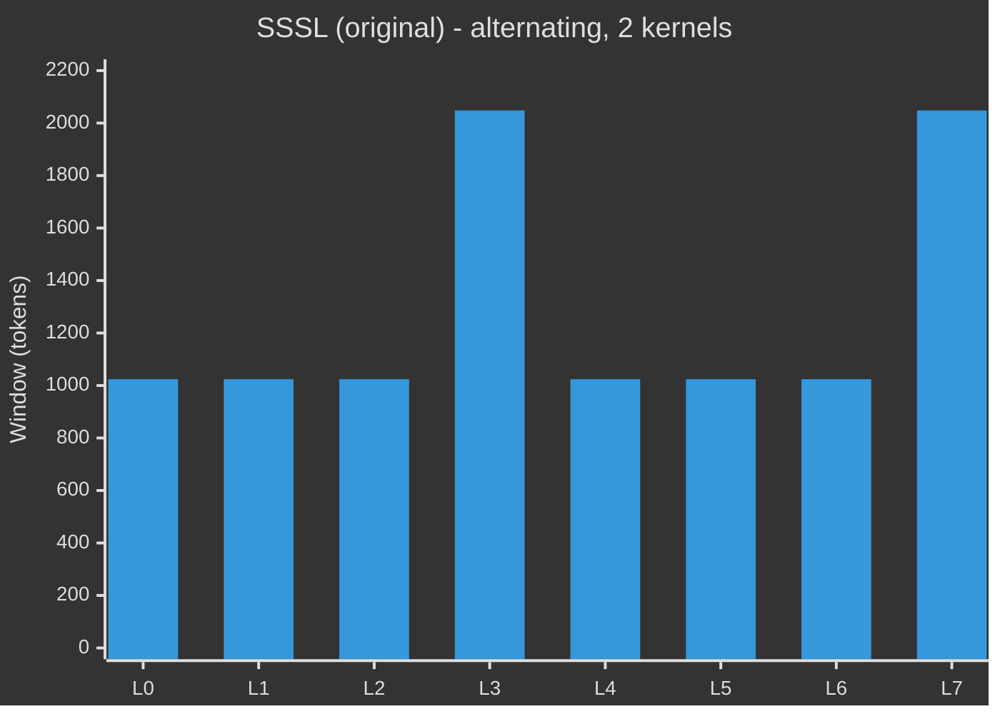

# Model Architecture — pc-architecture-v2

> Config: `n_layer=8, n_embd=512, n_head=4, n_kv_head=4, head_dim=128, seq_len=2048`

---

## Data Flow

```mermaid
%%{init: {"theme": "dark"}}%%
flowchart TD
    TOK["tokens (B, T)"]
    WTE["wte - Embedding(vocab, 512) bfloat16"]
    NORM0["RMSNorm"]
    TOK --> WTE --> NORM0

    NORM0 --> LOOP

    subgraph LOOP["Layer loop  i = 0 to 7"]
        direction TB

        RS["1. resid_lambdas[i] * x  per-layer scale"]

        subgraph SUMM_BOX["2. TemporalSummarizer  (layers 2, 4 only)"]
            direction LR
            CONV["depthwise Conv1d  kernel=4, causal"]
            PROJ_S["Linear(512->512)"]
            CONV --> PROJ_S
        end
        SUMM_SKIP{"layer 2 or 4?"}

        subgraph BLOCK["3. Block  (pre-norm)"]
            direction TB

            subgraph ATT["CausalSelfAttention"]
                direction TB
                QKV["c_q / c_k / c_v  Linear(512->512)"]
                VE_BOX{"Value Embed layers 1,3,5,7"}
                VE["ve Embedding(vocab, 512)\nve_gate Linear(32->4) sigmoid"]
                ROPE["RoPE + QK-norm"]
                TEMP["q x (attn_temp^2 + 0.01)\nlearnable temperature"]
                FA["Flash Attention 3\nor SDPA (causal, windowed)"]
                CPROJ["c_proj  Linear(512->512)"]
                QKV --> VE_BOX
                VE_BOX -- yes --> VE --> ROPE
                VE_BOX -- no --> ROPE
                ROPE --> TEMP --> FA --> CPROJ
            end

            subgraph MLP_BOX["MLP"]
                FC["c_fc  Linear(512->2048)"]
                ACT["ReLU^2"]
                MP["c_proj  Linear(2048->512)"]
                FC --> ACT --> MP
            end

            ATT --> MLP_BOX
        end

        subgraph PC["4-6. Predictive Coding"]
            direction TB
            PH["PredHead(norm(x))\nfc + proj  residual -> prediction"]
            ERR["raw_error = (target - pred) / pc_scale\npc_scale = sqrt(512) ~= 22.6"]
            LOSS_PC["ELBO per token\nL^2 * ||error||^2 - log(L^2)\nadd to pc_loss_map (B,T)"]
            GATE["routing_gate  Linear(512->1)\ngate = sigmoid in (0,1)"]
            CORR["x += gate * pc_alpha * L^2 * error\ntop-down correction"]
            PH --> ERR --> LOSS_PC
            ERR --> GATE --> CORR
        end

        subgraph SKIP_PC["Skip-layer targets  (history depth 5)"]
            direction LR
            S1["layers 0-1: skip 1"]
            S2["layers 2-3: skip 2"]
            S3["layers 4-5: skip 3"]
            S4["layers 6-7: skip 4"]
        end

        subgraph SL_BOX["7. StochasticLayer  (layers 2, 5 only)"]
            direction LR
            MU["mu_proj  Linear(512->512)"]
            LS["log_sigma_proj  Linear(512->512)\nclamped to [-6, 2]"]
            SAMP["z = mu + noise_scale * sigma * eps\nnoise=1 train / 0 eval"]
            KL_OUT["KL(q || N(0,1)) -> kl_loss"]
            MU --> SAMP
            LS --> SAMP --> KL_OUT
        end
        SL_SKIP{"layer 2 or 5?"}

        HIST["8. history.rotate()\ndrop oldest, append x.detach()"]

        RS --> SUMM_SKIP
        SUMM_SKIP -- yes --> SUMM_BOX --> BLOCK
        SUMM_SKIP -- no --> BLOCK
        BLOCK --> PC
        SKIP_PC -.->|history target| PC
        PC --> SL_SKIP
        SL_SKIP -- yes --> SL_BOX --> HIST
        SL_SKIP -- no --> HIST
    end

    HIST --> OUT_NORM

    OUT_NORM["RMSNorm"]
    LM["lm_head  Linear(512->vocab)  no bias"]
    SOFTCAP["softcap: 15 * tanh(logits / 15)"]
    OUT_NORM --> LM --> SOFTCAP

    subgraph LOSS_BOX["Loss (training)"]
        direction TB
        CE["token_ce = CE(logits, targets)  per token (B,T)"]
        MAIN["main_loss = mean(token_ce)\n+ 0.15*CE(t+2) + 0.05*CE(t+4)\nmulti-timescale auxiliary"]
        FOCAL["difficulty = (token_ce / mean)^gamma\nfocal weight - hard tokens get more PC signal"]
        PC_L["pc_loss = mean(pc_loss_map * difficulty) / n_layer"]
        AUX["aux_loss = pc_loss + kl_weight * kl_loss"]
        TOTAL["total = main_loss + PC_WEIGHT * aux_loss"]
        CE --> MAIN
        CE --> FOCAL --> PC_L --> AUX --> TOTAL
        MAIN --> TOTAL
    end

    SOFTCAP --> LOSS_BOX

    %% colour classes
    classDef inp    fill:#1e3a8a,stroke:#60a5fa,color:#e0f2fe,stroke-width:2px
    classDef norm   fill:#312e81,stroke:#818cf8,color:#e0e7ff,stroke-width:1px
    classDef scale  fill:#3b0764,stroke:#a855f7,color:#f3e8ff,stroke-width:1px
    classDef summ   fill:#164e63,stroke:#22d3ee,color:#cffafe,stroke-width:2px
    classDef attn   fill:#4c1d95,stroke:#a78bfa,color:#ede9fe,stroke-width:2px
    classDef mlp    fill:#14532d,stroke:#4ade80,color:#dcfce7,stroke-width:2px
    classDef pc     fill:#78350f,stroke:#fbbf24,color:#fef3c7,stroke-width:2px
    classDef skip   fill:#0c4a6e,stroke:#38bdf8,color:#e0f2fe,stroke-width:1px
    classDef stoch  fill:#881337,stroke:#fb7185,color:#ffe4e6,stroke-width:2px
    classDef hist   fill:#1e293b,stroke:#475569,color:#cbd5e1,stroke-width:1px
    classDef out    fill:#1e3a5f,stroke:#3b82f6,color:#dbeafe,stroke-width:2px
    classDef loss   fill:#422006,stroke:#f97316,color:#ffedd5,stroke-width:2px
    classDef total  fill:#713f12,stroke:#fbbf24,color:#fef9c3,stroke-width:3px
    classDef dec    fill:#1f2937,stroke:#6b7280,color:#d1d5db,stroke-width:1px

    class TOK,WTE         inp
    class NORM0,OUT_NORM  norm
    class RS              scale
    class CONV,PROJ_S     summ
    class QKV,VE,ROPE,TEMP,FA,CPROJ  attn
    class FC,ACT,MP       mlp
    class PH,ERR,LOSS_PC,GATE,CORR   pc
    class S1,S2,S3,S4     skip
    class MU,LS,SAMP,KL_OUT          stoch
    class HIST            hist
    class LM,SOFTCAP      out
    class CE,MAIN,FOCAL,PC_L,AUX     loss
    class TOTAL           total
    class SUMM_SKIP,SL_SKIP,VE_BOX   dec
```

---

## Attention Windows (seq=2048, n=8)

Three available patterns — window size per layer:







| Pattern | Min window | Scaling | Unique kernels | Default |
|---------|-----------|---------|----------------|---------|
| `LOG` | 256 | ~1.3× per layer (geometric) | 8 | **yes** |
| `PROGRESSIVE` | 1024 | Step at n//2 | 2 | — |
| `SSSL` | 1024 | Alternating | 2 | — |

`LOG` starts narrow (256 = seq/8) so early layers are forced to extract local features, then expands geometrically. Each layer sees ~1.3× the context of the previous, matching the DTM timescale hierarchy most closely. The 8 unique FA3 kernels are compiled once and cached to disk; subsequent runs pay no extra startup cost.

---

## Skip-Layer PC Targets

```mermaid
%%{init: {'theme': 'dark'}}%%
flowchart LR
    L0["L0"]
    L1["L1"]
    L2["L2"]
    L3["L3"]
    L4["L4"]
    L5["L5"]
    L6["L6"]
    L7["L7"]
    H1["history[−1]"]
    H2["history[−2]"]
    H3["history[−3]"]
    H4["history[−4]"]

    L0 & L1 -->|skip 1| H1
    L2 & L3 -->|skip 2| H2
    L4 & L5 -->|skip 3| H3
    L6 & L7 -->|skip 4| H4

    classDef shallow  fill:#1e3a8a,stroke:#60a5fa,color:#dbeafe,stroke-width:2px
    classDef mid      fill:#065f46,stroke:#34d399,color:#d1fae5,stroke-width:2px
    classDef deep     fill:#78350f,stroke:#fbbf24,color:#fef3c7,stroke-width:2px
    classDef deepest  fill:#881337,stroke:#fb7185,color:#ffe4e6,stroke-width:2px
    classDef hist     fill:#1e293b,stroke:#475569,color:#cbd5e1,stroke-width:2px

    class L0,L1  shallow
    class L2,L3  mid
    class L4,L5  deep
    class L6,L7  deepest
    class H1,H2,H3,H4  hist
```

Shallow layers predict one step back (local refinement). Deep layers predict up to four steps back, propagating PC error signals from the output all the way to early representations.

---

## Special Layers at a Glance

| Layer | TemporalSummarizer | Value Embed | StochasticLayer | Skip dist |
|-------|--------------------|-------------|-----------------|-----------|
| 0 | — | — | — | 1 |
| 1 | — | ✓ | — | 1 |
| 2 | ✓ | — | ✓ | 2 |
| 3 | — | ✓ | — | 2 |
| 4 | ✓ | — | — | 3 |
| 5 | — | ✓ | ✓ | 3 |
| 6 | — | — | — | 4 |
| 7 | — | ✓ | — | 4 |

---

## Parameter Groups and Optimizers

| Group | Parameters | Optimizer | LR |
|-------|-----------|-----------|-----|
| `wte` | vocab × 512 | AdamW | `embedding_lr / √(512/768)` |
| `lm_head` | vocab × 512 | AdamW | `unembedding_lr / √(512/768)` |
| `value_embeds` (×4) | 4 × vocab × 512 | AdamW | `embedding_lr / √(512/768)` |
| `resid_lambdas`, `pc_lambdas`, `attn_temp` (24 scalars) | 24 | AdamW | `scalar_lr × 0.01` |
| `pred_head` + `routing_gate` (×8) | ~4.2 M | AdamW | `matrix_lr` |
| `TemporalSummarizer` (×2) | ~530 K | AdamW | `matrix_lr` |
| `StochasticLayer` (×2) | ~1 M | AdamW | `matrix_lr` |
| All other backbone matrices | ~29 M | **Muon** | `matrix_lr` |

LR schedule: flat → warmdown over last 50% of budget, cosine to 0.

---

## Sweepable Buffers (no recompile when changed)

| Buffer | Default | Effect |
|--------|---------|--------|
| `PC_WEIGHT` | 0.1 | Scales total `aux_loss` contribution to the gradient |
| `pc_alpha` | 0.1 | Scales the top-down routing correction added back to `x` |
| `pc_focal_gamma` | 1.0 | Exponent for output-difficulty weighting of `pc_loss` (0 = uniform) |
| `kl_weight` | 0.01 | Scales the KL divergence loss from stochastic layers |
| `pc_scale` | √512 ≈ 22.6 | Fixed denominator making prediction errors dimensionless (Bogacz 2017) |
