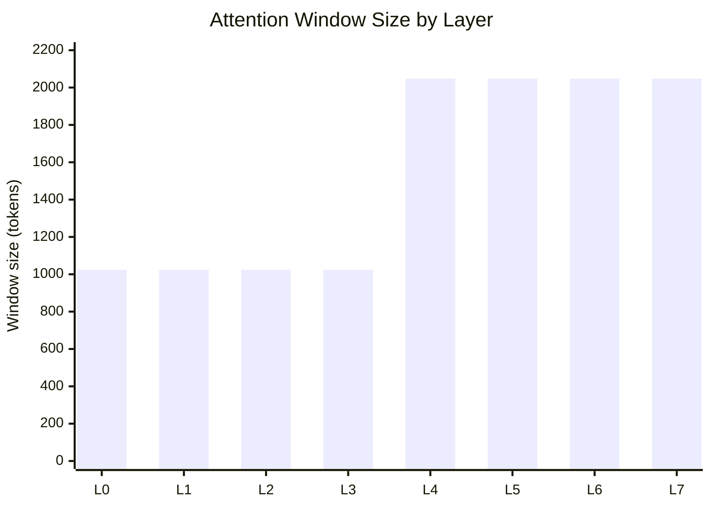
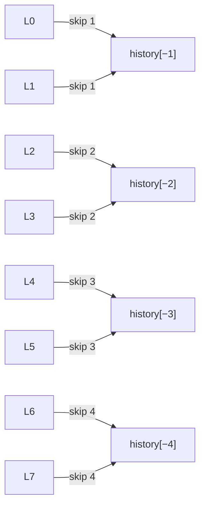

# Model Architecture — pc-architecture-v2

> Config: `n_layer=8, n_embd=512, n_head=4, n_kv_head=4, head_dim=128, seq_len=2048`

---

## Data Flow

```mermaid
flowchart TD
    TOK["tokens (B, T)"]
    WTE["wte · Embedding(vocab, 512)\nbfloat16"]
    NORM0["RMSNorm"]
    TOK --> WTE --> NORM0

    NORM0 --> LOOP

    subgraph LOOP["Layer loop  i = 0 … 7"]
        direction TB

        RS["① resid_lambdas[i] · x\nlearnable per-layer scale"]

        subgraph SUMM_BOX["② TemporalSummarizer  (layers 2, 4 only)"]
            direction LR
            CONV["depthwise Conv1d\nkernel=4, causal"]
            PROJ_S["Linear(512→512)"]
            CONV --> PROJ_S
        end
        SUMM_SKIP{"i ∈ {2,4}?"}

        subgraph BLOCK["③ Block  (pre-norm)"]
            direction TB

            subgraph ATT["CausalSelfAttention"]
                direction TB
                QKV["c_q / c_k / c_v  Linear(512→512)"]
                VE_BOX{"Value Embed\n(layers 1,3,5,7)"}
                VE["ve · Embedding(vocab, 512)\nve_gate Linear(32→4) sigmoid"]
                ROPE["RoPE  +  QK-norm"]
                TEMP["q  ×  (attn_temp² + 0.01)\nlearnable temperature"]
                FA["Flash Attention 3\nor SDPA (causal, windowed)"]
                CPROJ["c_proj  Linear(512→512)"]
                QKV --> VE_BOX
                VE_BOX -- yes --> VE --> ROPE
                VE_BOX -- no --> ROPE
                ROPE --> TEMP --> FA --> CPROJ
            end

            subgraph MLP_BOX["MLP"]
                FC["c_fc  Linear(512→2048)"]
                ACT["ReLU²"]
                MP["c_proj  Linear(2048→512)"]
                FC --> ACT --> MP
            end

            ATT --> MLP_BOX
        end

        subgraph PC["④–⑥ Predictive Coding"]
            direction TB
            PH["PredHead(norm(x))\nfc Linear(512→512) + proj Linear(512→512)\nresidual  →  prediction"]
            ERR["raw_error = (target − pred) / pc_scale\npc_scale = √512 ≈ 22.6  (dimensionless)"]
            LOSS_PC["ELBO loss per token\nλ² · ‖error‖² − log(λ²)\nadd to pc_loss_map (B,T)"]
            GATE["routing_gate  Linear(512→1)\ngate = sigmoid(·) ∈ (0,1)"]
            CORR["x += gate · pc_alpha · λ² · error\n(top-down correction)"]
            PH --> ERR --> LOSS_PC
            ERR --> GATE --> CORR
        end

        subgraph SKIP_PC["Skip-layer target  (history buffer depth 5)"]
            direction LR
            S1["layers 0–1: skip 1"]
            S2["layers 2–3: skip 2"]
            S3["layers 4–5: skip 3"]
            S4["layers 6–7: skip 4"]
        end

        subgraph SL_BOX["⑦ StochasticLayer  (layers 2, 5 only)"]
            direction LR
            MU["mu_proj  Linear(512→512)"]
            LS["log_sigma_proj  Linear(512→512)\nclamped to [−6, 2]"]
            SAMP["z = mu + noise_scale · σ · ε\nnoise_scale=1 train / 0 eval"]
            KL_OUT["KL(q ∥ N(0,1)) → kl_loss"]
            MU --> SAMP
            LS --> SAMP --> KL_OUT
        end
        SL_SKIP{"i ∈ {2,5}?"}

        HIST["⑧ history.rotate()\ndrop oldest, append x.detach()"]

        RS --> SUMM_SKIP
        SUMM_SKIP -- yes --> SUMM_BOX --> BLOCK
        SUMM_SKIP -- no --> BLOCK
        BLOCK --> PC
        SKIP_PC -.->|history target| PC
        PC --> SL_SKIP
        SL_SKIP -- yes --> SL_BOX --> HIST
        SL_SKIP -- no --> HIST
    end

    HIST --> OUT_NORM

    OUT_NORM["RMSNorm"]
    LM["lm_head  Linear(512→vocab)  no bias"]
    SOFTCAP["softcap: 15·tanh(logits/15)"]
    OUT_NORM --> LM --> SOFTCAP

    subgraph LOSS_BOX["Loss (training)"]
        direction TB
        CE["token_ce = CE(logits, targets)  per token (B,T)"]
        MAIN["main_loss = mean(token_ce)\n+ 0.15·CE(t+2)  + 0.05·CE(t+4)\nmulti-timescale auxiliary"]
        FOCAL["difficulty = (token_ce / mean)^pc_focal_gamma\nfocal weight — hard tokens get more PC signal"]
        PC_L["pc_loss = mean(pc_loss_map · difficulty) / n_layer"]
        AUX["aux_loss = pc_loss  +  kl_weight · kl_loss"]
        TOTAL["total = main_loss  +  PC_WEIGHT · aux_loss"]
        CE --> MAIN
        CE --> FOCAL --> PC_L --> AUX --> TOTAL
        MAIN --> TOTAL
    end

    SOFTCAP --> LOSS_BOX
```

---

## Attention Windows (PROGRESSIVE pattern, seq=2048)

Lower half of the network attends to 1 024 tokens (local). Upper half attends to the full 2 048-token context. Two levels instead of four cuts the number of unique FA3 kernels compiled, reducing cold-cache startup time.

---

## Skip-Layer PC Targets

Shallow layers predict only one step back (local refinement). Deep layers predict up to four steps back, creating long-range top-down signals that propagate PC error all the way from the output back to early representations.

---

## Special Layers at a Glance

| Layer | TemporalSummarizer | Value Embed | StochasticLayer | Skip dist |
|-------|--------------------|-------------|-----------------|-----------|
| 0 | — | — | — | 1 |
| 1 | — | ✓ | — | 1 |
| 2 | ✓ | — | ✓ | 2 |
| 3 | — | ✓ | — | 2 |
| 4 | ✓ | — | — | 3 |
| 5 | — | ✓ | ✓ | 3 |
| 6 | — | — | — | 4 |
| 7 | — | ✓ | — | 4 |

---

## Parameter Groups and Optimizers

| Group | Parameters | Optimizer | LR |
|-------|-----------|-----------|-----|
| `wte` | vocab × 512 | AdamW | `embedding_lr / √(512/768)` |
| `lm_head` | vocab × 512 | AdamW | `unembedding_lr / √(512/768)` |
| `value_embeds` (×4) | 4 × vocab × 512 | AdamW | `embedding_lr / √(512/768)` |
| `resid_lambdas`, `pc_lambdas`, `attn_temp` (24 scalars) | 24 | AdamW | `scalar_lr × 0.01` |
| `pred_head` + `routing_gate` (×8) | ~4.2 M | AdamW | `matrix_lr` |
| `TemporalSummarizer` (×2) | ~530 K | AdamW | `matrix_lr` |
| `StochasticLayer` (×2) | ~1 M | AdamW | `matrix_lr` |
| All other backbone matrices | ~29 M | **Muon** | `matrix_lr` |

LR schedule: flat → warmdown over last 50% of budget, cosine to 0.

---

## Sweepable Buffers (no recompile when changed)

| Buffer | Default | Effect |
|--------|---------|--------|
| `PC_WEIGHT` | 0.1 | Scales total `aux_loss` contribution to the gradient |
| `pc_alpha` | 0.1 | Scales the top-down routing correction added back to `x` |
| `pc_focal_gamma` | 1.0 | Exponent for output-difficulty weighting of `pc_loss` (0 = uniform) |
| `kl_weight` | 0.01 | Scales the KL divergence loss from stochastic layers |
| `pc_scale` | √512 ≈ 22.6 | Fixed denominator making prediction errors dimensionless (Bogacz 2017) |
