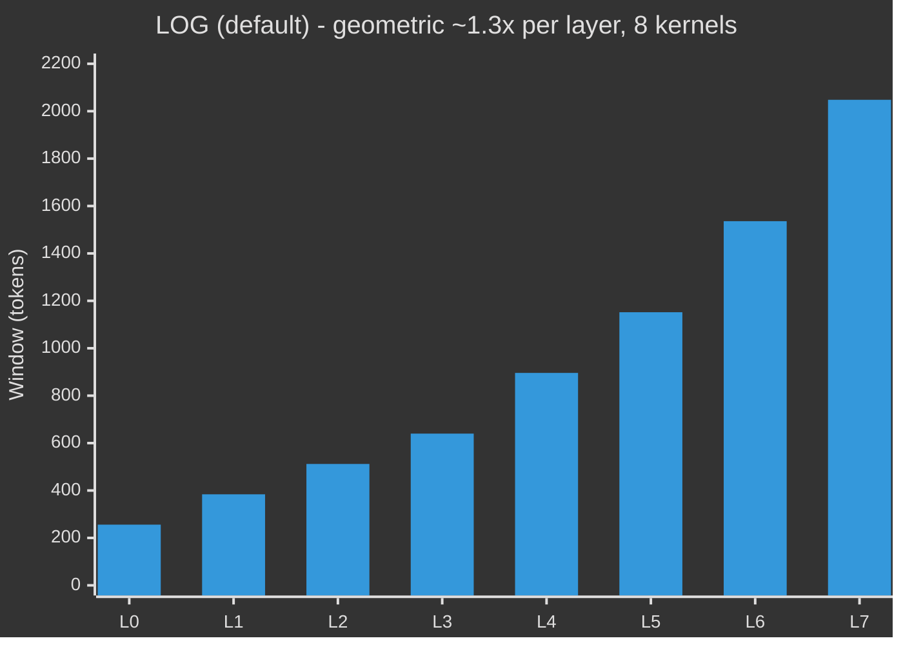
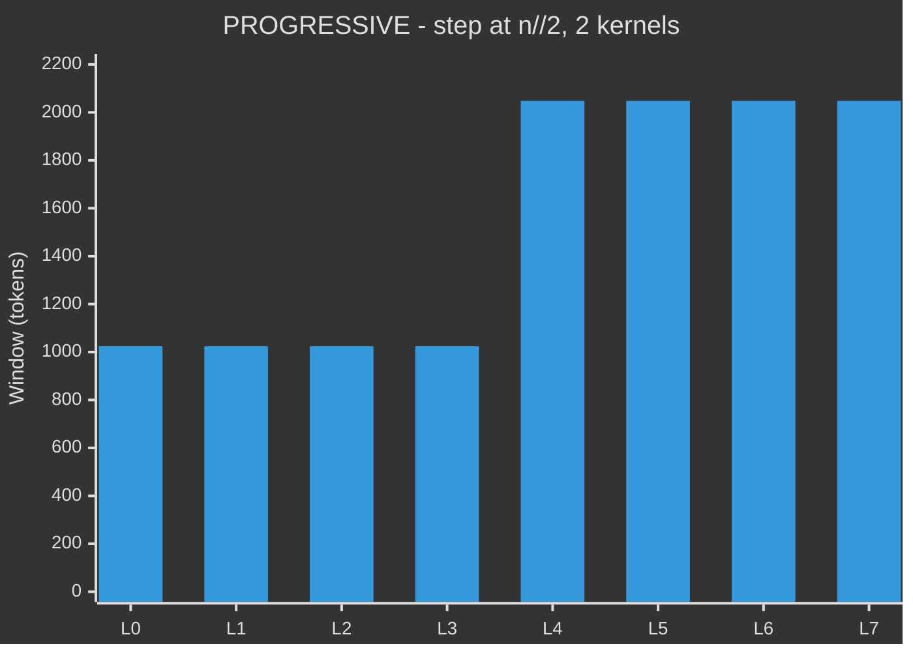
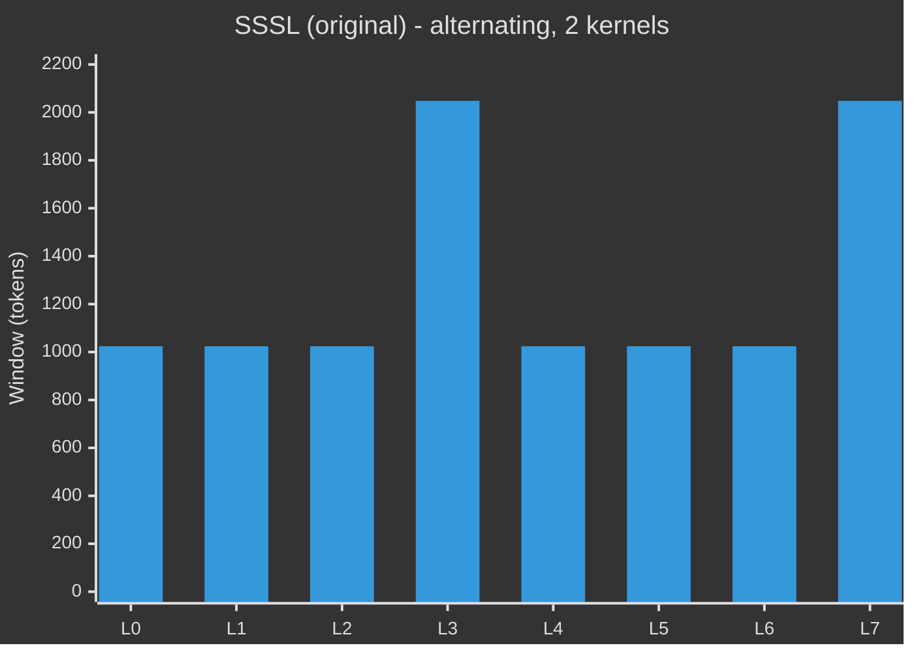

# Model Architecture — pc-architecture-v2

> Config: `n_layer=8, n_embd=512, n_head=4, n_kv_head=4, head_dim=128, seq_len=2048`

---

## Data Flow

```mermaid
%%{init: {"theme": "dark"}}%%
flowchart TD
    TOK["tokens  B x T"]
    EMB["Embedding  vocab -> 512  bf16"]
    N0["RMSNorm"]
    TOK --> EMB --> N0

    subgraph LAYER["One layer  repeated x8  i = 0...7"]
        SCALE["resid_lambdas[i] * x"]
        SUMM["TemporalSummarizer  layers 2 and 4 only\nConv1d causal  + Linear  residual add"]
        ATTN["CausalSelfAttention\nRoPE   QK-norm   windowed FA3\nattn_temp^2 precision   value embeds on alt layers"]
        MLP_N["MLP   512 -> 2048 -> 512\nReLU^2 activation"]
        PRED["PredHead\npredict history skip layers back"]
        ERR["prediction error\n(target - pred) / pc_scale"]
        ELBO["ELBO per token  side accumulation\nL^2 * err^2 - log(L^2)  into pc_loss_map"]
        CORR["top-down correction\nx += gate * alpha * L^2 * error\ngate = sigmoid(routing_gate(x))"]
        STOCH["StochasticLayer  layers 2 and 5 only\nz = mu + noise * sigma   adds KL loss"]
        HIST["history buffer rotate\nappend x.detach()"]

        SCALE --> SUMM --> ATTN --> MLP_N --> PRED --> ERR
        ERR -.->|loss accum| ELBO
        ERR --> CORR --> STOCH --> HIST
    end

    N0 --> SCALE
    HIST --> OUTNORM

    OUTNORM["RMSNorm"]
    HEAD["lm_head   Linear 512 -> vocab   no bias"]
    CAP["softcap   15 * tanh(logits / 15)"]
    OUTNORM --> HEAD --> CAP

    subgraph LOSS["Loss  training only"]
        CE["cross-entropy per token  B x T"]
        AUX["+ 0.15 * CE t+2   + 0.05 * CE t+4\nmulti-timescale auxiliary"]
        FOCAL["difficulty = (token_ce / mean)^gamma\nfocal weight  hard tokens get more PC signal"]
        PCLOSS["pc_loss = mean(loss_map * difficulty) / 8\n+ kl_weight * kl_loss"]
        TOTAL["total = main_loss + PC_WEIGHT * aux_loss"]
        CE --> AUX --> TOTAL
        CE --> FOCAL --> PCLOSS --> TOTAL
    end

    CAP --> CE

    classDef inp   fill:#1e3a8a,stroke:#60a5fa,color:#e0f2fe,stroke-width:2px
    classDef norm  fill:#312e81,stroke:#818cf8,color:#e0e7ff,stroke-width:1px
    classDef scale fill:#3b0764,stroke:#a855f7,color:#f3e8ff,stroke-width:1px
    classDef summ  fill:#164e63,stroke:#22d3ee,color:#cffafe,stroke-width:2px
    classDef attn  fill:#4c1d95,stroke:#a78bfa,color:#ede9fe,stroke-width:2px
    classDef mlp   fill:#14532d,stroke:#4ade80,color:#dcfce7,stroke-width:2px
    classDef pc    fill:#78350f,stroke:#fbbf24,color:#fef3c7,stroke-width:2px
    classDef stoch fill:#881337,stroke:#fb7185,color:#ffe4e6,stroke-width:2px
    classDef hist  fill:#1e293b,stroke:#475569,color:#cbd5e1,stroke-width:1px
    classDef out   fill:#1e3a5f,stroke:#3b82f6,color:#dbeafe,stroke-width:2px
    classDef loss  fill:#422006,stroke:#f97316,color:#ffedd5,stroke-width:2px
    classDef total fill:#713f12,stroke:#fbbf24,color:#fef9c3,stroke-width:3px

    class TOK,EMB        inp
    class N0,OUTNORM     norm
    class SCALE          scale
    class SUMM           summ
    class ATTN           attn
    class MLP_N          mlp
    class PRED,ERR,ELBO,CORR  pc
    class STOCH          stoch
    class HIST           hist
    class HEAD,CAP       out
    class CE,AUX,FOCAL,PCLOSS  loss
    class TOTAL          total
```

---

## Attention Windows (seq=2048, n=8)

Three available patterns — window size per layer:







| Pattern | Min window | Scaling | Unique kernels | Default |
|---------|-----------|---------|----------------|---------|
| `LOG` | 256 | ~1.3× per layer (geometric) | 8 | **yes** |
| `PROGRESSIVE` | 1024 | Step at n//2 | 2 | — |
| `SSSL` | 1024 | Alternating | 2 | — |

`LOG` starts narrow (256 = seq/8) so early layers are forced to extract local features, then expands geometrically. Each layer sees ~1.3× the context of the previous, matching the DTM timescale hierarchy most closely. The 8 unique FA3 kernels are compiled once and cached to disk; subsequent runs pay no extra startup cost.

---

## Skip-Layer PC Targets

```mermaid
%%{init: {'theme': 'dark'}}%%
flowchart LR
    L0["L0"]
    L1["L1"]
    L2["L2"]
    L3["L3"]
    L4["L4"]
    L5["L5"]
    L6["L6"]
    L7["L7"]
    H1["history[-1]"]
    H2["history[-2]"]
    H3["history[-3]"]
    H4["history[-4]"]

    L0 & L1 -->|skip 1| H1
    L2 & L3 -->|skip 2| H2
    L4 & L5 -->|skip 3| H3
    L6 & L7 -->|skip 4| H4

    classDef shallow  fill:#1e3a8a,stroke:#60a5fa,color:#dbeafe,stroke-width:2px
    classDef mid      fill:#065f46,stroke:#34d399,color:#d1fae5,stroke-width:2px
    classDef deep     fill:#78350f,stroke:#fbbf24,color:#fef3c7,stroke-width:2px
    classDef deepest  fill:#881337,stroke:#fb7185,color:#ffe4e6,stroke-width:2px
    classDef hist     fill:#1e293b,stroke:#475569,color:#cbd5e1,stroke-width:2px

    class L0,L1  shallow
    class L2,L3  mid
    class L4,L5  deep
    class L6,L7  deepest
    class H1,H2,H3,H4  hist
```

Shallow layers predict one step back (local refinement). Deep layers predict up to four steps back, propagating PC error signals from the output all the way to early representations.

---

## Special Layers at a Glance

| Layer | TemporalSummarizer | Value Embed | StochasticLayer | Skip dist |
|-------|--------------------|-------------|-----------------|-----------|
| 0 | — | — | — | 1 |
| 1 | — | ✓ | — | 1 |
| 2 | ✓ | — | ✓ | 2 |
| 3 | — | ✓ | — | 2 |
| 4 | ✓ | — | — | 3 |
| 5 | — | ✓ | ✓ | 3 |
| 6 | — | — | — | 4 |
| 7 | — | ✓ | — | 4 |

---

## Parameter Groups and Optimizers

| Group | Parameters | Optimizer | LR |
|-------|-----------|-----------|-----|
| `wte` | vocab × 512 | AdamW | `embedding_lr / √(512/768)` |
| `lm_head` | vocab × 512 | AdamW | `unembedding_lr / √(512/768)` |
| `value_embeds` (×4) | 4 × vocab × 512 | AdamW | `embedding_lr / √(512/768)` |
| `resid_lambdas`, `pc_lambdas`, `attn_temp` (24 scalars) | 24 | AdamW | `scalar_lr × 0.01` |
| `pred_head` + `routing_gate` (×8) | ~4.2 M | AdamW | `matrix_lr` |
| `TemporalSummarizer` (×2) | ~530 K | AdamW | `matrix_lr` |
| `StochasticLayer` (×2) | ~1 M | AdamW | `matrix_lr` |
| All other backbone matrices | ~29 M | **Muon** | `matrix_lr` |

LR schedule: flat → warmdown over last 50% of budget, cosine to 0.

---

## Sweepable Buffers (no recompile when changed)

| Buffer | Default | Effect |
|--------|---------|--------|
| `PC_WEIGHT` | 0.1 | Scales total `aux_loss` contribution to the gradient |
| `pc_alpha` | 0.1 | Scales the top-down routing correction added back to `x` |
| `pc_focal_gamma` | 1.0 | Exponent for output-difficulty weighting of `pc_loss` (0 = uniform) |
| `kl_weight` | 0.01 | Scales the KL divergence loss from stochastic layers |
| `pc_scale` | √512 ≈ 22.6 | Fixed denominator making prediction errors dimensionless (Bogacz 2017) |
