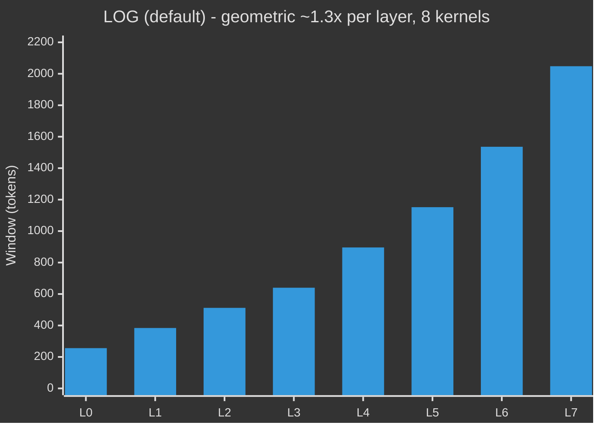
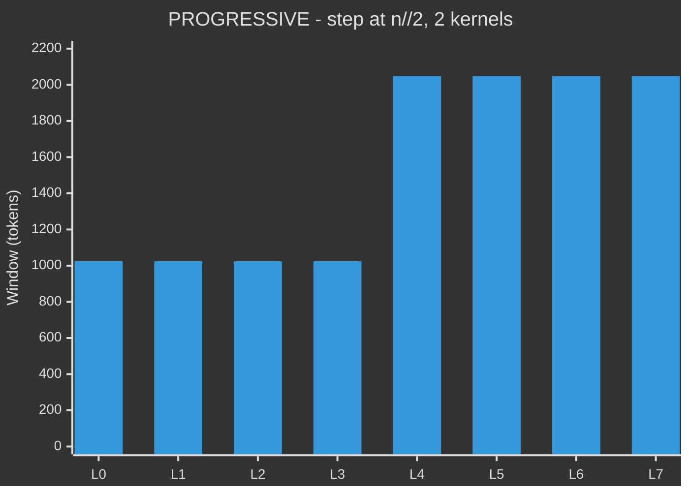
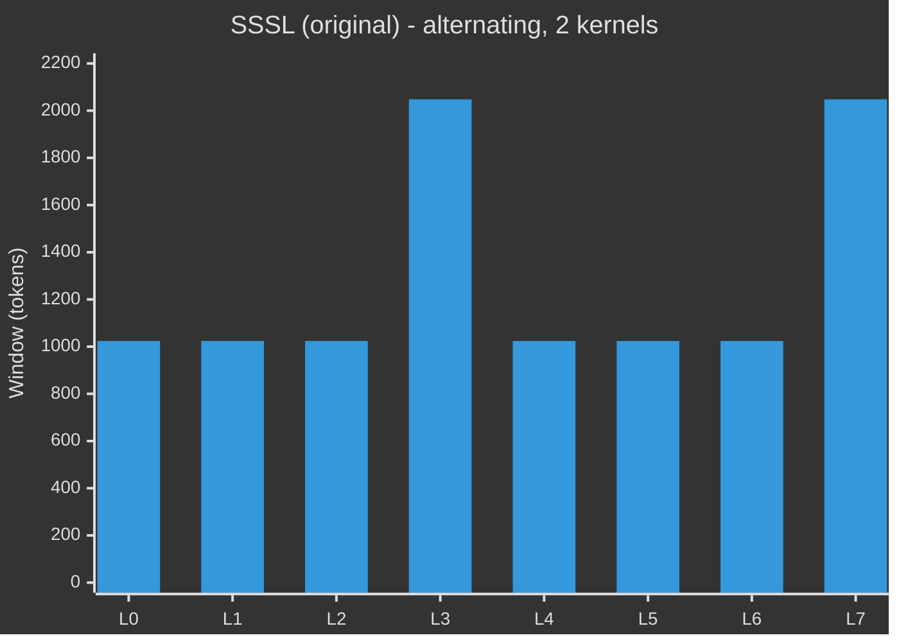

# Model Architecture — pc-architecture-v2

> Config: `n_layer=8, n_embd=512, n_head=4, n_kv_head=4, head_dim=128, seq_len=2048, pc_head_dim=64, ve_gate_channels=32`

---

## Data Flow

```mermaid
%%{init: {"theme": "dark"}}%%
flowchart TD
    TOK["tokens  B x T"]
    EMB["Embedding  vocab -> 512  bf16\n(weight-tied to lm_head)"]
    N0["RMSNorm"]
    TOK --> EMB --> N0

    subgraph LAYER["One layer  repeated x8  i = 0...7"]
        SCALE["softplus(resid_lambdas[i]) * x\nalways-positive learned residual scale"]
        SUMM["TemporalSummarizer  layers 2 and 4 only\nConv1d causal  + Linear  residual add"]
        ATTN["CausalSelfAttention\nRoPE   QK-norm   windowed FA3\nattn_temp^2 precision   value embeds on alt layers\nve_gate_channels=32"]
        MLP_N["MLP   512 -> 2048 -> 512\nReLU^2 activation"]
        STOCH["StochasticLayer  layers 2 and 5 only\nz = mu + noise * sigma   KL in float32\nadds KL loss"]
        layer_outs["layer_outs[i] = x\ncollect all 8 outputs"]

        SCALE --> SUMM --> ATTN --> MLP_N
        MLP_N --> STOCH --> layer_outs
    end

    subgraph PHASE2["Phase 2  hierarchical PC  after all layers  (only when reduction='mean'; eval skips)"]
        EMA["pc_ema[i]  shape (n_layer-1, n_embd)\nEMA of norm(layer_outs[i+1])  decay=0.99\nupdated outside compiled graph each step"]
        PRED["residual bottleneck pred head\npred = h + proj(tanh(fc(h)))\n(L, B, T, pc_head_dim=64) -> (L, B, T, 512)"]
        ERR["raw_error = (ema_target - pred) / pc_scale\nema_target = pc_ema broadcast to (L, B, T, C)"]
        PCWEIGHT["pc_w = softplus(pc_log_lambdas[i])\ntoken_pc = pc_w * mean(raw_error^2, dim=C)"]
        GATE["learned routing gate  per-layer\nsigmoid(h.detach() @ pc_gate_w + pc_gate_b)  (L, B, T)\nh detached — backbone cannot null the gate"]
        PCLOSS_A["pc_loss_map = sum_L(gate * token_pc)  (B, T)\ngradient flows back to each layer's params"]
        EMA --> PRED --> ERR --> PCWEIGHT --> PCLOSS_A
        ERR --> GATE --> PCLOSS_A
    end

    N0 --> SCALE
    layer_outs --> EMA
    layer_outs --> OUTNORM

    OUTNORM["RMSNorm"]
    HEAD["lm_head   Linear 512 -> vocab   no bias\n(weight-tied to wte)"]
    CAP["softcap   15 * tanh(logits / 15)"]
    OUTNORM --> HEAD --> CAP

    subgraph LOSS["Loss  training only"]
        CE["cross-entropy per token  B x T"]
        AUX["+ 0.15 * CE t+2   + 0.05 * CE t+4\nper-horizon dedicated aux_lm_heads  std=0.001 init"]
        FOCAL["difficulty = (token_ce / mean)^gamma\nfocal weight  hard tokens get more PC signal"]
        PCLOSS["pc_loss = mean(loss_map * difficulty) / 7\n+ kl_weight * kl_loss"]
        TOTAL["total = main_loss + PC_WEIGHT * aux_loss"]
        CE --> AUX --> TOTAL
        CE --> FOCAL --> PCLOSS --> TOTAL
    end

    CAP --> CE

    classDef buf   fill:#1e293b,stroke:#64748b,color:#94a3b8,stroke-width:1px
    classDef inp   fill:#1e3a8a,stroke:#60a5fa,color:#e0f2fe,stroke-width:2px
    classDef norm  fill:#312e81,stroke:#818cf8,color:#e0e7ff,stroke-width:1px
    classDef scale fill:#3b0764,stroke:#a855f7,color:#f3e8ff,stroke-width:1px
    classDef summ  fill:#164e63,stroke:#22d3ee,color:#cffafe,stroke-width:2px
    classDef attn  fill:#4c1d95,stroke:#a78bfa,color:#ede9fe,stroke-width:2px
    classDef mlp   fill:#14532d,stroke:#4ade80,color:#dcfce7,stroke-width:2px
    classDef pc    fill:#78350f,stroke:#fbbf24,color:#fef3c7,stroke-width:2px
    classDef stoch fill:#881337,stroke:#fb7185,color:#ffe4e6,stroke-width:2px
    classDef hist  fill:#1e293b,stroke:#475569,color:#cbd5e1,stroke-width:1px
    classDef out   fill:#1e3a5f,stroke:#3b82f6,color:#dbeafe,stroke-width:2px
    classDef loss  fill:#422006,stroke:#f97316,color:#ffedd5,stroke-width:2px
    classDef total fill:#713f12,stroke:#fbbf24,color:#fef9c3,stroke-width:3px

    class TOK,EMB        inp
    class N0,OUTNORM     norm
    class SCALE          scale
    class SUMM           summ
    class ATTN           attn
    class MLP_N          mlp
    class layer_outs  buf
    class BROADCAST,PRED,ERR,PCWEIGHT,GATE,PCLOSS_A  pc
    class STOCH          stoch
    class HIST           hist
    class HEAD,CAP       out
    class CE,AUX,FOCAL,PCLOSS  loss
    class TOTAL          total
```

---

## Mathematical equations (from train.py)

The following definitions match the implementation. Batch size \(B\), sequence length \(T\), embedding dimension \(C = n\_embd\), number of layers \(n\).

### Normalisation and residual scale

- **RMSNorm** (applied to Q, K, and to layer inputs before attn/MLP):
  \[
  \mathrm{norm}(x) = \frac{x}{\sqrt{\frac{1}{C}\sum_{c=1}^C x_c^2 + \epsilon}}
  \]

- **Per-layer residual scale** (before each block):
  \[
  \lambda_i = \mathrm{softplus}(\mathtt{resid\_lambdas}[i]), \qquad x \leftarrow \lambda_i \cdot x
  \]

### Block (attention + MLP)

- **Pre-norm residual block**:
  \[
  x \leftarrow x + \mathrm{Attn}(\mathrm{norm}(x)); \qquad x \leftarrow x + \mathrm{MLP}(\mathrm{norm}(x))
  \]

- **Attention**: \(Q = W_q x\), \(K = W_k x\), \(V = W_v x\). Value residual (when VE present): \(v \leftarrow v + 2\,\sigma(W_{ve}(x_{1:vgc})) \odot \mathrm{VE}(\mathrm{idx})\). RoPE on \(Q,K\); then \(\tilde{Q},\tilde{K} = \mathrm{norm}(\mathrm{RoPE}(Q)), \mathrm{norm}(\mathrm{RoPE}(K))\); temperature \(\beta = (\mathtt{attn\_temp}^2 + 0.01)\); \(\tilde{Q} \leftarrow \beta \cdot \tilde{Q}\). Causal (and optional window) masked softmax attention: \(\mathrm{Attn}(x) = W_o\,\mathrm{Attention}(\tilde{Q}, \tilde{K}, V)\).

- **MLP** (ReLU²):
  \[
  \mathrm{MLP}(x) = W_2\,\bigl(\mathrm{ReLU}(W_1 x)\bigr)^2
  \]

### StochasticLayer (layers 2, 5, …)

- **Reparameterisation**: \(\mu = W_\mu x\), \(\log\sigma = \mathrm{clamp}(W_\sigma x, -6, 2)\), \(\sigma = \exp(\log\sigma)\). Training: \(z = \mu + \xi \cdot \sigma \odot \varepsilon\), \(\varepsilon \sim \mathcal{N}(0,I)\); eval: \(z = \mu\).
- **KL** (in float32):
  \[
  \mathrm{KL}(q\,\|\, \mathcal{N}(0,1)) = \frac{1}{2}\bigl(\sigma^2 + \mu^2 - 2\log\sigma - 1\bigr), \qquad \mathtt{kl} = \mathrm{mean}(\mathrm{KL})
  \]

### TemporalSummarizer (layers n//3, 2n//3)

- Causal depthwise Conv1d (kernel size 4) then linear proj; residual: \(x \leftarrow x + \mathrm{proj}(\mathrm{conv}(x))\); sequence length unchanged.

### Phase 2: hierarchical PC

Phase 2 (PC stack, EMA target, pred head, gate, pc_loss_map) runs only when `reduction=='mean'` (training). When `reduction=='none'` (e.g. `evaluate_bpb`), this block is skipped and `pc_loss` is zero.

- **Predictor stack and EMA target**: \(L = n-1\). \(\hat{h}_i = \mathrm{norm}(\mathrm{layer\_outs}[i])\) for \(i=0..n-1\). \(h = [\hat{h}_0,\ldots,\hat{h}_{L-1}]\) stacked → \((L,B,T,C)\). EMA target (read-only in forward): \(\mathtt{ema\_target} = \mathtt{pc\_ema}\) broadcast from \((L,C)\) to \((L,B,T,C)\) (same dtype as \(h\)).

- **Prediction head** (residual bottleneck, per layer \(i\)):
  \[
  \mathrm{pred}_i = h_i + W_{\mathrm{proj},i}^\top\,\tanh(W_{\mathrm{fc},i}\, h_i)
  \]
  with \(W_{\mathrm{fc},i} \in \mathbb{R}^{d_h \times C}\), \(W_{\mathrm{proj},i} \in \mathbb{R}^{d_h \times C}\), \(d_h = \mathtt{pc\_head\_dim}\).

- **Scaled prediction error** (Bogacz 2017): \(\mathtt{pc\_scale} = \sqrt{C}\).
  \[
  e_i = \frac{\mathtt{ema\_target}_i - \mathrm{pred}_i}{\mathtt{pc\_scale}}, \qquad
  \mathtt{token\_pc}_i = \mathrm{softplus}(\mathtt{pc\_log\_lambdas}[i]) \cdot \frac{1}{C}\sum_c e_{i,c}^2
  \]

- **Routing gate** (on detached \(h\)):
  \[
  g_i = \sigma\bigl( h_i.detach() \cdot w_{\mathrm{gate},i} + b_{\mathrm{gate},i} \bigr), \qquad
  \mathtt{pc\_loss\_map} = \sum_{i=0}^{L-1} g_i \odot \mathtt{token\_pc}_i \quad \in \mathbb{R}^{B \times T}
  \]

- **Focal weighting and PC loss**: \(\mathtt{token\_ce}\) = per-token cross-entropy (B,T). Difficulty (detached): \(\mathtt{difficulty} = \bigl(\mathtt{token\_ce} / (\mathrm{mean}(\mathtt{token\_ce}) + 10^{-6})\bigr)^\gamma\). Then
  \[
  \mathtt{pc\_loss} = \frac{1}{L}\,\mathrm{mean}\bigl(\mathtt{pc\_loss\_map} \odot \mathtt{difficulty}\bigr), \qquad
  \mathtt{aux\_loss} = \mathtt{pc\_loss} + \mathtt{kl\_weight} \cdot \mathtt{kl\_loss}
  \]

- **Layer means for EMA update** (returned from forward when `reduction='mean'`):
  \[
  \mathtt{layer\_means}[i] = \mathrm{mean}_{b,t}\Bigl(\mathrm{norm}(\mathrm{layer\_outs}[i+1])_{b,t}\Bigr) \in \mathbb{R}^C
  \]
  Updated in the training loop (outside the compiled graph): \(\mathtt{pc\_ema} \leftarrow \rho\,\mathtt{pc\_ema} + (1-\rho)\,\mathtt{layer\_means}\) with \(\rho = \mathtt{PC\_EMA\_DECAY}\) (default 0.99).

### Output and loss

- **Logits**: \(x = \hat{h}_{n-1}\); \(\mathtt{logits} = \mathtt{softcap} \cdot \tanh\bigl(W_{\mathrm{lm}}\,x \cdot \exp(\mathtt{lm\_head\_log\_scale}) / \mathtt{softcap}\bigr)\) with \(\mathtt{softcap} = 15\).

- **Main loss**: \(\mathcal{L}_{\mathrm{main}} = \mathrm{mean}(\mathtt{token\_ce}) + 0.15\,\mathcal{L}_{t+2} + 0.05\,\mathcal{L}_{t+4}\) (aux horizons 2 and 4 with dedicated heads).

- **Total loss**:
  \[
  \mathcal{L} = \mathcal{L}_{\mathrm{main}} + \mathtt{PC\_WEIGHT} \cdot \mathtt{aux\_loss}
  \]

---

## Attention Windows (seq=2048, n=8)

Three available patterns — window size per layer:







| Pattern | Min window | Scaling | Unique kernels | Default |
|---------|-----------|---------|----------------|---------|
| `LOG` | 256 | ~1.3× per layer (geometric) | 8 | **yes** |
| `PROGRESSIVE` | 1024 | Step at n//2 | 2 | — |
| `SSSL` | 1024 | Alternating | 2 | — |

`LOG` starts narrow (256 = seq/8) so early layers are forced to extract local features, then expands geometrically. Each layer sees ~1.3× the context of the previous, matching the DTM timescale hierarchy most closely. The 8 unique FA3 kernels are compiled once and cached to disk; subsequent runs pay no extra startup cost.

---

## Hierarchical PC Targets

```mermaid
%%{init: {"theme": "dark"}}%%
flowchart LR
    L0["L0"]
    L1["L1"]
    L2["L2"]
    L3["L3"]
    L4["L4"]
    L5["L5"]
    L6["L6"]
    L7["L7"]

    L0 -->|predict| L1
    L1 -->|predict| L2
    L2 -->|predict| L3
    L3 -->|predict| L4
    L4 -->|predict| L5
    L5 -->|predict| L6
    L6 -->|predict| L7

    classDef pred   fill:#78350f,stroke:#fbbf24,color:#fef3c7,stroke-width:2px
    classDef target fill:#4c1d95,stroke:#a78bfa,color:#ede9fe,stroke-width:3px

    class L0,L1,L2,L3,L4,L5,L6  pred
    class L1,L2,L3,L4,L5,L6,L7  target
```

Each layer predicts its immediate neighbour. The target for layer i is a per-layer exponential moving average of `norm(layer_outs[i+1])` across recent training steps, stored in the `pc_ema` buffer (shape `n_layer-1, n_embd`):

```
pc_ema[i] ← 0.99 · pc_ema[i] + 0.01 · norm(layer_outs[i+1]).mean(B, T)
```

The EMA is updated in the training loop **outside** the compiled graph (so `forward()` treats it as read-only, preserving `fullgraph=True`). Inside `forward()`, the EMA is broadcast from `(L, C)` to `(L, B, T, C)` and used directly as `ema_target`.

**Why EMA instead of instantaneous targets**: runs 19–20 showed that using `norm(layer_outs[i+1]).detach()` directly caused pc_loss to oscillate over four orders of magnitude (0→4348) because the PC heads chased a target moving at the speed of the backbone's CE gradient. The EMA (~100-step time constant) decouples target velocity from backbone learning rate, allowing PC head gradients to accumulate coherently.

---

## Special Layers at a Glance

| Layer | TemporalSummarizer | Value Embed | StochasticLayer | Skip dist |
|-------|--------------------|-------------|-----------------|-----------|
| 0 | — | — | — | 1 |
| 1 | — | ✓ | — | 1 |
| 2 | ✓ | — | ✓ | 2 |
| 3 | — | ✓ | — | 2 |
| 4 | ✓ | — | — | 3 |
| 5 | — | ✓ | ✓ | 3 |
| 6 | — | — | — | 4 |
| 7 | — | ✓ | — | 4 |

TemporalSummarizer slots: `{n//3, 2*(n//3)}` = {2, 4} for n=8.
StochasticLayer slots: `range(2, n_layer, 3)` = {2, 5} for n=8.

---

## PC Prediction Head

Each of the n-1 predictor layers uses a shared-weight **residual bottleneck** head:

```
pred = h + pc_proj_w[i]ᵀ · tanh(pc_fc_w[i] · h)
```

where `pc_fc_w: (n_layer, pc_head_dim, n_embd)` and `pc_proj_w: (n_layer, pc_head_dim, n_embd)`.
Both are batched over the layer dimension via einsum, so Phase 2 is a single kernel launch.
Both `pc_fc_w` and `pc_proj_w` are zero-initialised so `pred = h` (identity residual) at step 0 and both weights grow together from the first gradient step, avoiding a discontinuous jump in prediction error.

`pc_head_dim` defaults to `max(64, DEPTH * ASPECT_RATIO // 8)` = 64 and is sweepable via `PC_HEAD_DIM`.

**EMA target buffer** (`pc_ema`): a persistent buffer of shape `(n_layer-1, n_embd)` storing the exponentially smoothed per-layer mean representation. Zero-initialised; updated outside the compiled graph after each optimizer step. The PC heads predict this slowly-moving target rather than the instantaneous backbone output.

The routing gate is a learned linear probe on a **detached** copy of the hidden state:

```
gate[i, b, t] = sigmoid(h[i, b, t].detach() · pc_gate_w[i] + pc_gate_b[i])
```

Detaching `h` prevents the backbone from driving gate → 0 as a shortcut to minimize `pc_loss_map` without improving representations. `pc_gate_b` is initialised to 1.0 so `sigmoid(1) ≈ 0.73`; most tokens contribute at init.

---

## Parameter Groups and Optimizers

| Group | Parameters | Optimizer | LR |
|-------|-----------|-----------|-----|
| `wte` (= `lm_head`, weight-tied) | vocab × 512 | AdamW | `embedding_lr × √(768/512)` |
| `aux_lm_heads` (×2 horizons) | 2 × vocab × 512 | AdamW | `unembedding_lr × √(768/512)` |
| `value_embeds` (×4) | 4 × vocab × 512 | AdamW | `embedding_lr × √(768/512)` |
| `resid_lambdas`, `pc_log_lambdas`, `attn_temp` (24 scalars) | 24 | AdamW | `scalar_lr × 0.01` |
| PC heads (`pc_fc_w`, `pc_proj_w`, `pc_gate_w`, `pc_gate_b`) | ~540 K | AdamW | `matrix_lr × 0.1` |
| `TemporalSummarizer` (×2) | ~530 K | AdamW | `matrix_lr` |
| `StochasticLayer` (×2) | ~1 M | AdamW | `matrix_lr × 0.1` |
| All other backbone matrices | ~29 M | **Muon** | `matrix_lr` |

Notes:
- `lm_head.weight` is tied to `wte.weight` after `init_weights()` and before `setup_optimizer()`. The parameter is counted and updated once via `embedding_params`.
- `aux_lm_heads` are independent unembedding heads (one per horizon in `AUX_HORIZONS`), initialised with `std=0.001`. They share the `unembedding_lr` group but are not tied to `wte`.
- `PC heads` use `matrix_lr × 0.1`. Both `pc_fc_w` and `pc_proj_w` start at zero (identity residual). At full `matrix_lr=0.04` the Adam sign-step would cause rapid divergence against the simultaneously shifting backbone targets; the 0.1 scale keeps early steps stable.
- `StochasticLayer` uses `matrix_lr × stoch_lr_scale` (default 0.1). Adam sign-normalises gradients; at full `matrix_lr=0.04` each element shifts by ~0.9 per step, destabilising the near-identity init. The 0.1 scale keeps per-step shifts to ~0.09.
- LR scales by `1/√(n_embd/768)` — tuned at 768; wider models automatically get lower LR.
- Muon `weight_decay` is annealed linearly to 0 over training; AdamW groups use `weight_decay=0`.

LR schedule: flat → warmdown over last 50% of budget, cosine to 0.

---

## Expected Step-0 Loss

Random-init lower bound: `ln(vocab_size)` = `ln(8192)` ≈ **9.01 nats**.

Target step-0 loss: **~10.5 nats** (confirmed by smoke test: ≈10.80).

`wte` is initialised with `std = 1.75/√n_embd` (≈ 0.077 for n_embd=512), giving logit std ≈ 1.75 at step 0. Expected CE ≈ ln(8192) + σ²/2 ≈ 9.01 + 1.53 ≈ **10.54 nats**. A pre-warm step-0 diagnostic prints `logit_std` and `raw_CE` to confirm production matches the smoke test.

The production step-0 loss as reported by the EMA-smoothed training metric is typically higher than the raw diagnostic (≈16 nats in run 20 vs raw ≈10.5). This is because the EMA-debiased loss includes aux_lm_head contributions and accumulates the large gradient spike from step 1 into the smoothed value. The raw CE diagnostic is the reliable number.

**Previous init** (`5.0/√n_embd`, runs 16–19): gave logit std ≈ 5, E[CE] ≈ 21.5 nats, producing step-0 training losses of 17–23 nats. Changed after run 19.

---

## Sweepable Buffers (no recompile when changed)

| Buffer | Default | Effect |
|--------|---------|--------|
| `PC_WEIGHT` | 0.02 | Scales total `aux_loss` contribution to the gradient |
| `pc_focal_gamma` | 1.0 | Exponent for output-difficulty weighting of `pc_loss` (0 = uniform) |
| `kl_weight` | 0.01 | Scales the KL divergence loss from stochastic layers; linearly ramped from 0 over first 25 steps |
| `pc_scale` | √512 ≈ 22.6 | Fixed denominator making prediction errors dimensionless (Bogacz 2017) |

---

## Environment Variables

These are read once at launch and affect training setup or behavior without changing the compiled graph.

| Variable | Default | Effect |
|----------|---------|--------|
| `PC_WEIGHT` | `0.02` | Weight applied to `aux_loss` in the training loop |
| `PC_FOCAL_GAMMA` | `1.0` | Output-difficulty focal exponent (0 = uniform) |
| `KL_WEIGHT` | `0.01` | Final KL weight after warmup (25-step ramp) |
| `PC_HEAD_DIM` | `max(64, DEPTH*ASPECT_RATIO//8)` | Bottleneck dimension for PC prediction heads |
| `LOG_MIN_WINDOW` | `0` | Minimum attention window for LOG pattern (0 = auto: `seq_len // n_layer`); set e.g. `64` to override |
| `PC_DIAG_INTERVAL` | `50` | Steps between PC diagnostic prints (0 = off) |
| `RESUME_CHECKPOINT` | `""` | Path to a `checkpoint.pt` to resume from; restores model weights, optimizer state, `step`, and `total_training_time` |
| `VAL_INTERVAL` | `0` | Steps between mid-training `evaluate_bpb` calls (0 = disabled) |
| `TRAIN_TIME_BUDGET` | `360` | Training wall-clock budget in seconds |
